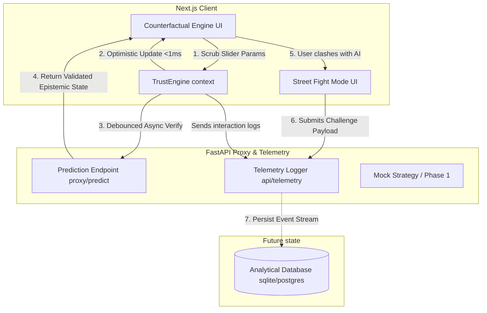
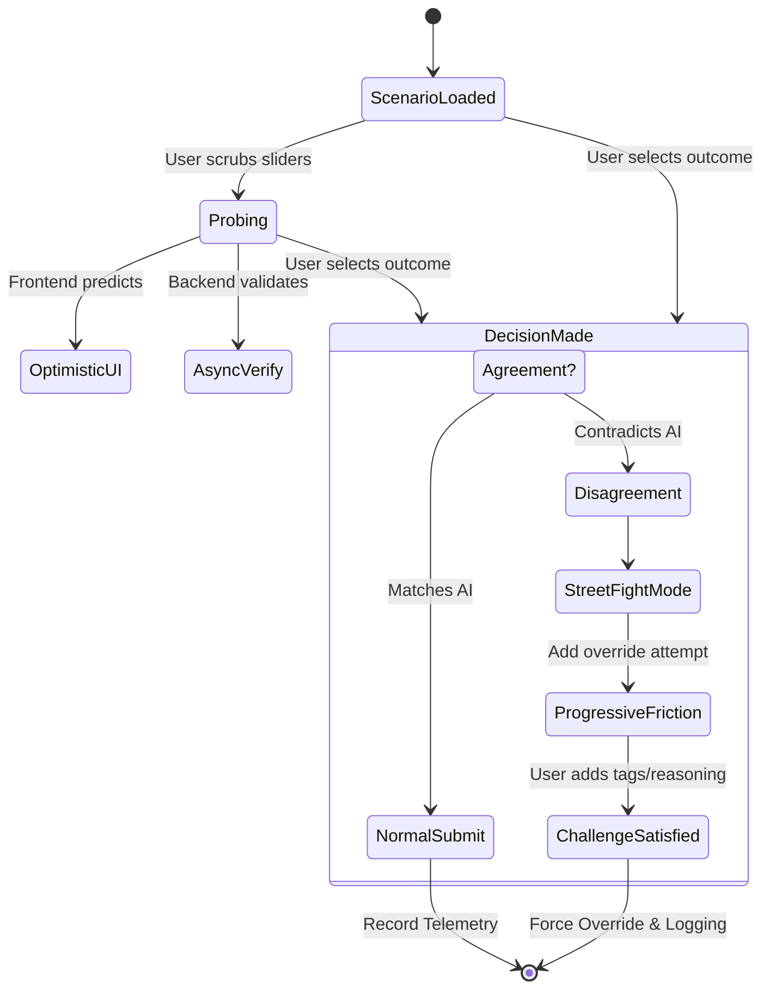

# TrustLab

An advanced, model-agnostic Human–AI interaction platform designed to study, measure, and calibrate human trust in AI predictions during high-stakes decision-making.

TrustLab replaces static "confidence scores" with visceral, adaptive UI components that react to both the AI's epistemic uncertainty and the user's behavioral reliance in real-time.

---

## 🧠 Core Philosophy
Traditional AI interfaces present a prediction and a generic score (e.g., "95% Confident"), leading to automation bias and over-reliance. TrustLab treats trust as an **adaptive metric** that must be continuously calibrated. 

Instead of passive consumption, users are forced to probe predictions, visualize ambiguity logically, and rigorously justify their disagreements when contradicting the AI.

---

## ✨ Key Features

* **The Epistemic Orb**: A glassmorphic visual indicator that morphs based on AI state. High confidence yields a sharp, steady pulse. High ambiguity or uncertainty introduces edge-blurring and shifting hues, communicating nuance instantly.
* **Counterfactual Engine**: Users can dynamically scrub scenario parameters (e.g., Applicant Income) and see sub-100ms optimistic UI updates predicting how the AI will react, establishing an intuitive mental model.
* **Implicit Trust Engine**: Synthesizes interaction time, slider activity, and final outcomes. If a user blindly approves a high-risk scenario in less than 3 seconds without investigating, the UI penalizes them visually and forces them to reconsider.
* **Street Fight Mode**: Replaces the generic "Submit" button with explicit outcome tracking. If the user contradicts the AI's prediction, the interface morphs into an adversarial challenge form, deploying progressive friction and forcing the user to tag data-gaps or write free text justifying their override.

---

## 🏗 System Architecture

TrustLab separates the frontend interaction layer from the LLM proxy to ensure strict schema enforcement and unblocked telemetry pipelines.



---

## ⚔️ Adaptive Interaction Flow



---

## 🛠 Tech Stack

### Frontend
- **Framework**: [Next.js](https://nextjs.org/) (React)
- **Animation**: [Framer Motion](https://www.framer.com/motion/) (Crucial for Epistemic Orb & state transitions)
- **Styling**: Tailwind CSS (Lucide-React for iconography)

### Backend
- **Framework**: [FastAPI](https://fastapi.tiangolo.com/) (Python)
- **Schema Validation**: Pydantic v2
- **Server**: Uvicorn

---

## 🚀 Getting Started

To run TrustLab locally, you will need two terminal windows to run both the frontend and backend microservices.

### Prerequisites
- Node.js `v18+`
- Python `3.10+`

### 1. Start the FastAPI Backend
The backend serves as the telemetry sink and the model-proxy.
```bash
cd backend

# Create and activate a virtual environment
python -m venv venv
source venv/bin/activate  # On Windows: venv\Scripts\activate

# Install dependencies
pip install -r requirements.txt

# Boot the server (defaults to http://localhost:8000)
uvicorn main:app --reload
```

### 2. Start the Next.js Frontend
```bash
cd frontend

# Install dependencies
npm install

# Run the dev server
npm run dev
```

### 3. Open the Dashboard
Navigate to `http://localhost:3000` in your browser. Move the interaction slider to watch the Epistemic Orb dynamically degrade/strengthen its confidence state, and try clicking "Approve/Reject" against the algorithm's advice to see Street Fight mode in action.

---

## 📊 Telemetry Payloads

TrustLab is built for academic user-studies. Every distinct action (slider tweaks, form time, explicit clashes) is shipped to the backend using standard JSON structures spanning exactly to the `TrustEvent` schema.

```json
{
  "participant_id": "84c8a2e1-4bb2-...-xyz",
  "event_type": "challenge_submitted",
  "timestamp": 1718228551,
  "metadata_payload": {
    "user_decision": "Reject Loan",
    "ai_prediction": "Approve with conditions",
    "reasoning_text": "AI missed context regarding massive local inflation.",
    "selected_tags": ["Missed context", "Edge case"],
    "override_attempts": 2
  }
}
```

---

*TrustLab is an open-source framework developed to enhance robust AI alignment testing and UX research.*
