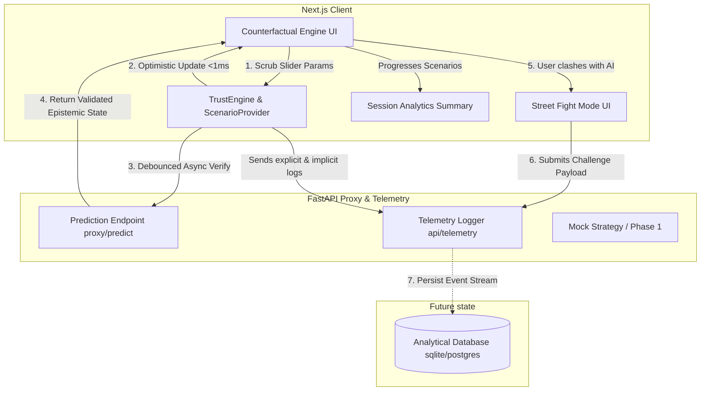
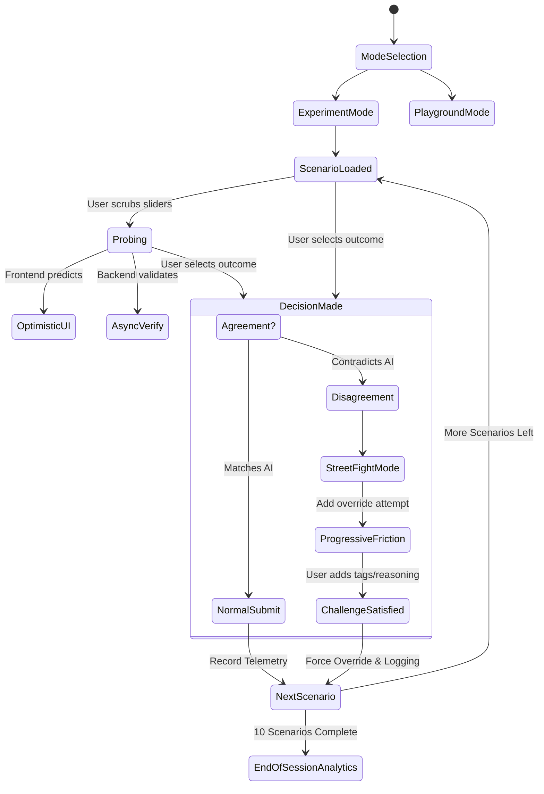

# TrustLab

An advanced, model-agnostic Human–AI interaction platform designed to study, measure, and calibrate human trust in AI predictions during high-stakes decision-making.

TrustLab replaces static "confidence scores" with visceral, adaptive UI components that react to both the AI's epistemic uncertainty and the user's behavioral reliance in real-time. It recently expanded from a single scenario demo into a **full experiment-driven workflow**.

---

## 🧠 Core Philosophy
Traditional Artificial Intelligence interfaces present a prediction and a generic score (e.g., "95% Confident"), leading to automation bias and over-reliance. TrustLab treats trust as an **adaptive metric** that must be continuously calibrated. 

Instead of passive consumption, users are forced to probe predictions, visualize ambiguity logically, and rigorously justify their disagreements when contradicting the AI.

---

## ✨ Key Features

* **Multi-Scenario Experiment Workflow**: Runs users through a structured 10-scenario experiment (or an open Playground Mode) featuring curated trust profiles: trust-building cases, over-trust traps, under-trust tests, and conflict scenarios.
* **The Epistemic Orb**: A glassmorphic visual indicator that morphs based on AI state. High confidence yields a sharp, steady pulse. High ambiguity or uncertainty introduces edge-blurring and shifting hues, communicating nuance instantly.
* **Counterfactual Engine**: Users can dynamically scrub scenario parameters (e.g., Applicant Income) and see sub-100ms optimistic UI updates predicting how the AI will react, establishing an intuitive mental model.
* **Implicit Trust Tracking & Telemetry**: Synthesizes interaction time, slider activity, and final outcomes across rounds. It detects behavioral shifts (e.g., slipping into "Over-Reliant" behavior) and adapts the interface to force friction.
* **Street Fight Mode**: Replaces the generic "Submit" button with explicit outcome tracking. If the user contradicts the AI's prediction, the interface morphs into an adversarial challenge form, deploying progressive friction and forcing the user to tag data-gaps or write free text justifying their override.
* **End-of-Session Analytics**: At the completion of an experiment, a beautiful dashboard (using Recharts) visualizes decision accuracy, temporal trust trends, and a comprehensive timeline of every interaction. 

---

## 🏗 System Architecture

TrustLab separates the frontend interaction layer from the LLM proxy to ensure strict schema enforcement and unblocked telemetry pipelines.



---

## ⚔️ Adaptive Interaction Flow



---

## 🛠 Tech Stack

### Frontend
- **Framework**: [Next.js](https://nextjs.org/) (React)
- **Animation**: [Framer Motion](https://www.framer.com/motion/) (Crucial for Epistemic Orb & state transitions)
- **Charting**: [Recharts](https://recharts.org/) (For End-of-Session Dashboard)
- **Styling**: Tailwind CSS (Lucide-React for iconography)

### Backend
- **Framework**: [FastAPI](https://fastapi.tiangolo.com/) (Python)
- **Schema Validation**: Pydantic v2
- **Server**: Uvicorn

---

## 🚀 Getting Started

To run TrustLab locally, you will need two terminal windows to run both the frontend and backend microservices.

### Prerequisites
- Node.js `v18+`
- Python `3.10+`

### 1. Start the FastAPI Backend
The backend serves as the telemetry sink and the model-proxy.
```bash
cd backend

# Create and activate a virtual environment
python -m venv venv
source venv/bin/activate  # On Windows: venv\Scripts\activate

# Install dependencies
pip install -r requirements.txt

# Boot the server (defaults to http://localhost:8000)
uvicorn main:app --reload
```

### 2. Start the Next.js Frontend
```bash
cd frontend

# Install dependencies
npm install

# Run the dev server
npm run dev
```

### 3. Open the Dashboard
Navigate to `http://localhost:3000` in your browser. Choose **Experiment Mode** to run through the 10 scenario tests, interact with the counterfactual sliders, challenge the AI via Street Fight Mode, and review your final trust calibration analytics.

---

## 📊 Telemetry Payloads

TrustLab is built for academic user-studies. Every distinct action (slider tweaks, form time, explicit clashes, scenario progressions) is shipped to the backend using standard JSON structures spanning exactly to the `TrustEvent` schema.

```json
{
  "participant_id": "84c8a2e1-4bb2-...-xyz",
  "event_type": "challenge_submitted",
  "timestamp": 1718228551,
  "metadata_payload": {
    "user_decision": "Reject Loan",
    "ai_prediction": "Approve with conditions",
    "reasoning_text": "AI missed context regarding massive local inflation.",
    "selected_tags": ["Missed context", "Edge case"],
    "override_attempts": 2
  }
}
```

---

*TrustLab is an open-source framework developed to enhance robust AI alignment testing and UX research.*
